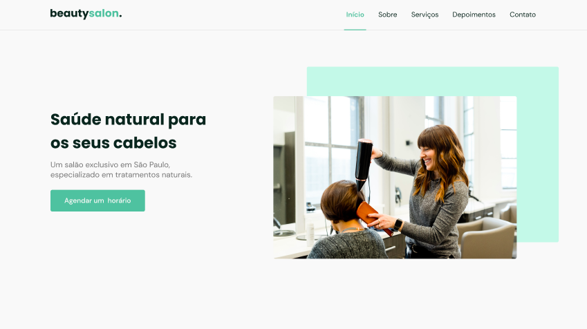
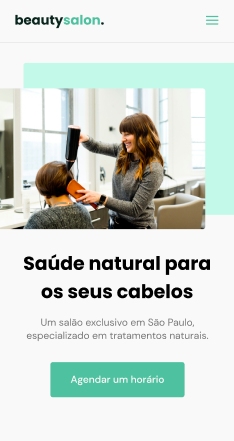

# NLW Together
### Designer Desktop

### Designer Mobile

### Links Úteis
* [Link Figma para o designer inicial do projeto](https://www.figma.com/community/file/1009807319507822993, "Figma")
* [Link Unsplash para o site de onde foi retirado as imagens](https://unsplash.com, "Unsplash")

> Evento Criado Pela Rocketseat, ministrado por Mayk Brito

## AULA - 01

### Aprendizados:
* Uso de variáveis CSS 
* Conceito de Mobile First
* Utilização de Flexbox & Grid Layout
* Breve Explicação sobre CEO & Semantica
* Detalhes sobre Border-Box, Resete e Especificação

## AULA - 02
### Aprendizados:
* Em breve
## AULA - 03
### Aprendizados:
* Em breve

## AULA - 04
### Aprendizados:
* Em breve

## AULA - 05
### Aprendizados:
* Em breve

